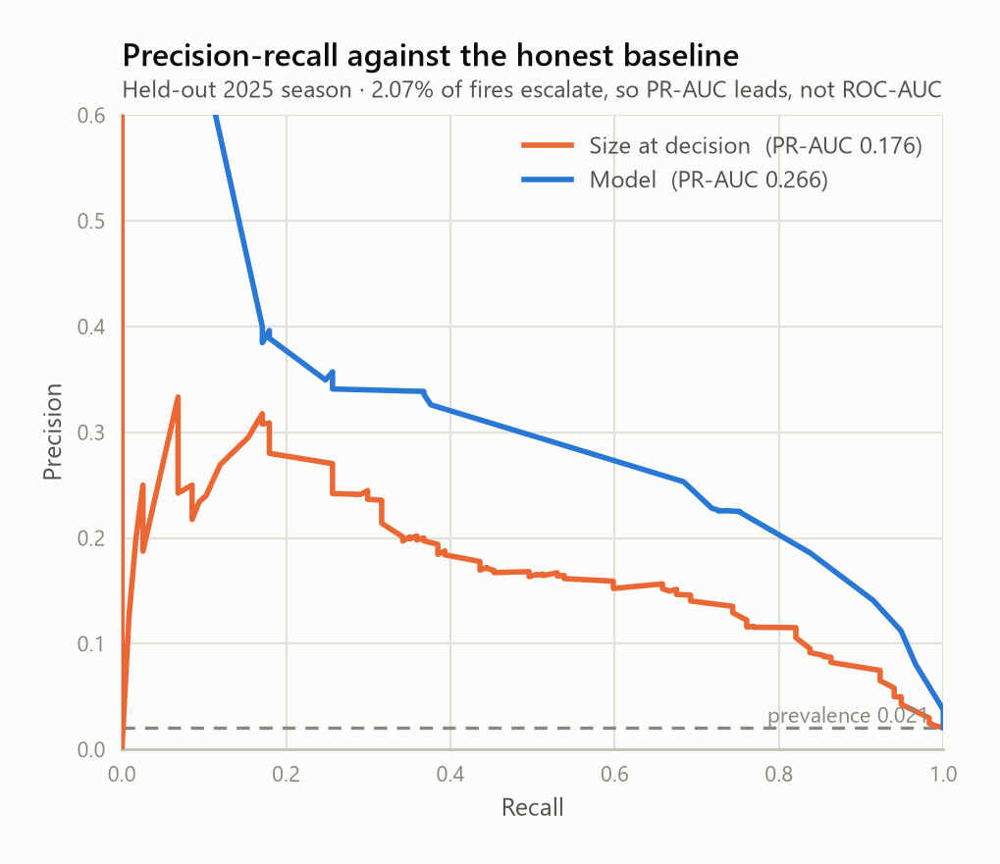
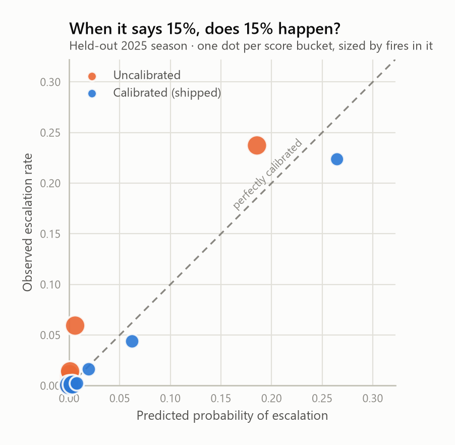
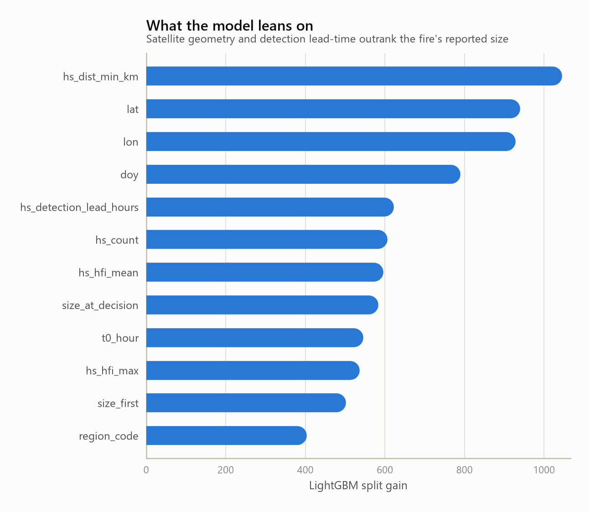
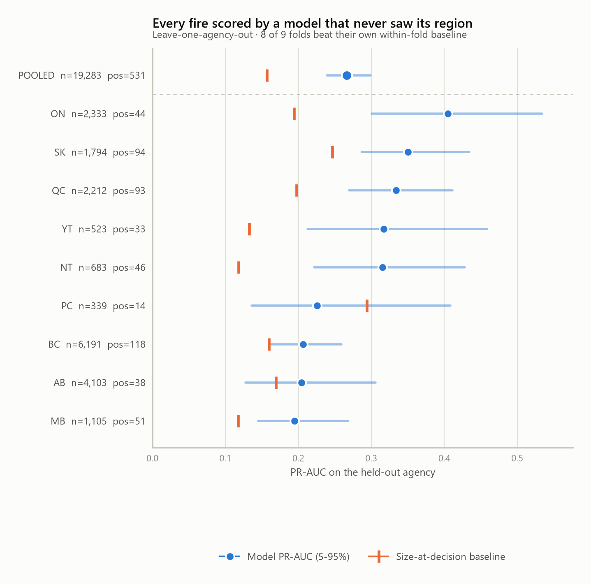

# wildfire-forecast

Predicting **wildfire escalation** in Canada from open government feeds: a fire
enters the national reporting system, and 24 hours later we ask whether it will
be a large fire (≥ 100 ha) three days after discovery.

Three legs, each load-bearing:

| Leg | Source | Why it is here |
|---|---|---|
| **API / OGC services** | CWFIF national GeoServer (WFS), CWFIS download services, Open-Meteo ERA5, NASA FIRMS | dense signal: fire state, satellite detections, weather |
| **Browser-rendered source** | CIFFC national situation report | the only source of National Preparedness Level — a human judgement with no machine feed |
| **ML** | LightGBM escalation classifier, season- and region-blocked backtests | the actual question |

---

## The dashboard

One self-contained HTML file — a map of every fire reported in the last three
weeks, shaded by modelled escalation risk, with the ranked watchlist beside it
and the validation charts below:

```bash
python -m wildfire dashboard
```

Writes [`docs/dashboard.html`](docs/dashboard.html) (~570 KB) with everything
inlined: provincial boundaries, the scored fires, and the charts as base64. It
makes **zero external requests**, so it works offline and cannot lose its
basemap to a CDN that moved. It is rebuilt from the same artefacts the CLI
writes, so the page cannot drift from the model it describes.

The map is Lambert conformal conic — the projection Canada is conventionally
drawn in. Equirectangular would stretch Nunavut badly enough to misplace
northern fires by eye.

> The page carries a prominent notice that this is a research model and not
> operational guidance. That is not boilerplate: it shows real fires that are
> burning right now, and someone landing on it cold could otherwise mistake it
> for something official.

---

## The idea the project is built on

The CWFIF reported-fires layer is **bitemporal**. Every fire carries many rows,
each with a `record_start` / `record_end` pair describing the window during
which that row was the system's current belief:

```
2026_PC_2026RM4   0.2 ha  UC   record_start 2026-05-14T15:45 → 21:45
2026_PC_2026RM4   0.05 ha EX   record_start 2026-05-14T21:45 → (open)
```

That means "what was known about this fire at time T" is a **filter**, not a
reconstruction:

```sql
WHERE record_start <= T
```

Point-in-time correctness — normally the hardest thing to get right in a
forecasting pipeline, and the usual source of silently inflated metrics — is
therefore guaranteed at the source rather than by discipline in our code. Every
feature goes through `features/asof.py`, and `tests/test_asof.py` asserts that a
revision recorded after the decision time can never leak into a feature.

Observed depth (2023–2026): **121,600 revision rows across 23,165 fires**, 4–6
revisions per fire. Deep enough to model on; `wildfire diagnose` re-checks this
and flags any year that was backfilled as a flat snapshot.

## No credentials required

The entire Canadian pipeline runs with **zero API keys**. NRCan publishes open
directory listings at `cwfis.cfs.nrcan.gc.ca/downloads/`, and Open-Meteo needs no
key. NASA FIRMS (which does need a free MAP_KEY) is wired up but **optional** —
it buys near-real-time latency (~3 h vs next-morning) and non-Canadian coverage,
not core capability.

A pleasant surprise: the CWFIS hotspot feed is materially richer than raw FIRMS.
Each detection already carries Canadian FBP System outputs computed at that
pixel — `hfi` (head fire intensity, kW/m), `ros` (rate of spread), fuel type,
fuel consumption, and `fwi`. That is a lot of fire science we do not have to
reimplement.

## Architecture

```
sources/          landing zone            features/            models/
┌──────────────┐  data/raw/**            ┌──────────────┐    ┌───────────────┐
│ cwfis_fires  │─ verbatim responses ───►│ asof.py      │───►│ escalation.py │
│  (WFS, page) │  + ETag/Last-Modified   │  ONLY way to │    │  LightGBM     │
│ cwfis_hotspot│  + fetched_at           │  read state  │    │  season-block │
│ openmeteo    │                         ├──────────────┤    │  PR-AUC +     │
│ firms  (opt) │  data/curated/**        │ build.py     │    │  calibration  │
│ ciffc (scrape│─ typed parquet ────────►│  DuckDB      │    └───────────────┘
└──────────────┘                         │  haversine   │
                                         └──────────────┘
```

**Storage is parquet + DuckDB, not Postgres/PostGIS.** Raw responses land
verbatim so a re-parse never costs another request; curated parquet is the
store; DuckDB is the compute engine for the spatial-temporal join (bounding-box
prefilter, then exact haversine). Postgres earns its place at the *serving*
layer, once there is an API to serve — it is not needed to answer the modelling
question, and requiring PostGIS to run a backtest would be friction for nothing.

## Quickstart

```bash
python -m venv .venv && .venv/Scripts/pip install -e .
cp .env.example .env          # optional; only needed for the FIRMS leg
```

```bash
python -m wildfire ingest-fires -y 2023 -y 2024 -y 2025 -y 2026
```

```bash
python -m wildfire ingest-hotspots -y 2023 -y 2024 -y 2025
```

```bash
python -m wildfire diagnose
```

```bash
python -m wildfire build
```

```bash
python -m wildfire backtest --test-years 2025
```

The CIFFC preparedness series backfills from a dated public API, no browser
required (see [below](#the-scraping-leg-that-turned-out-not-to-be-one)):

```bash
python -m wildfire ingest-ciffc -y 2023 -y 2024 -y 2025 -y 2026
```

The rendered-page fallback is still there, and still needs a browser, because
`ciffc.net/situation/` really is a 4 KB shell with an empty `#root`:

```bash
.venv/Scripts/pip install -e ".[scrape]" && .venv/Scripts/playwright install chromium
```

```bash
python -m wildfire scrape-ciffc
```

## The modelling contract

Defined once, in `config.EscalationSpec`:

- **T0** — first appearance in the national feed.
- **Decision time** T0 + 24 h — everything the model sees.
- **Horizon** T0 + 72 h — where the label is read.
- **Label** — `fire_size ≥ 100 ha` at the horizon.
- **Exclusions** — fires already ≥ 100 ha at decision time (the question is
  whether a fire *becomes* large, not whether a large fire stays large), and
  fires too recent to have a 72 h outcome yet (otherwise the newest fires all
  look like non-escalations and the model learns misplaced optimism).

Evaluation reports **three** numbers, not one: the model, a size-at-decision
baseline, and prevalence. A booster that cannot beat "how big is it already"
has learned nothing worth deploying.

## Season-blocked backtest (real numbers)

Train 2023–2024, test 2025. 12,097 fires train / 5,664 test, 2.07% escalation
rate in the test season. Intervals are a 1,000-draw percentile bootstrap over
the test fires, 5th–95th.

| metric | model | size-at-decision baseline | prevalence |
|---|---|---|---|
| PR-AUC | **0.264** [0.216, 0.320] | 0.176 [0.141, 0.228] | 0.021 |
| Brier | **0.0168** | — | 0.0203 |
| ROC-AUC | 0.946 | — | 0.5 |

<picture>
  <source media="(prefers-color-scheme: dark)" srcset="docs/img/pr-curve-dark.png">
  
</picture>

So: **1.50× the precision-recall of "how big is it already"**, and 13× the base
rate. ROC-AUC of 0.946 looks spectacular and mostly is not — with a 2%
positive rate it is dominated by easy negatives, which is exactly why PR-AUC
leads the table.

The interval matters here. 117 positives is not many, and the two marginal
intervals above overlap — which invites the wrong conclusion. The comparison
that settles it is the *paired* one, model and baseline scored on the same
resample: the difference is **+0.088 [0.033, 0.134]**, and the model wins in
**99.8%** of draws. Overlapping marginal intervals on two correlated
statistics are not evidence of a tie.

> **This number was not reproducible, twice, for two different reasons.**
> Both were found the same way: something that could not possibly have changed
> a number appeared to change one.
>
> *In the model.* LightGBM's row subsampling and the calibration split's
> tie-break both read row positions, so the same data laid out differently
> scored anywhere from 0.258 to 0.296 — a spread wider than any feature effect
> this project has measured. `_deterministic` now imposes a total order on
> `(t0, national_fire_id)` before anything reads a row position.
>
> *In the features, one layer down.* Fixing the model did not make the
> pipeline reproducible. DuckDB aggregates in parallel and reduces float64
> partial sums in whatever order threads finish; float addition is not
> associative, so `AVG` drifted in its last bits between runs of the same
> query on the same data, and `MODE` broke ties by scan order. About 35 of
> 21,500 fires had a feature cross a split threshold — worth ~0.008 PR-AUC.
> Sums now accumulate in `DECIMAL(18,6)`, which *is* associative, and the
> dominant fuel type comes from an explicit `ROW_NUMBER()` ordering.
>
> `tests/test_determinism.py` re-runs the aggregation on shuffled input and
> demands identical output; `tests/test_escalation.py` fails if row order ever
> changes a score. **0.264 is the figure that survives building the table
> twice and diffing it.** Every number on this page is post-fix.

Calibration mattered. The first version used `class_weight="balanced"` and had
a Brier score *worse than predicting the base rate* (0.0246 vs 0.0203) — its
top bucket predicted 16.9% where 10.1% actually escalated. Refitting unweighted
and isotonic-calibrating on a temporally held-back slice of the training window
fixed it: Brier 0.0168 against the base rate's 0.0203, and the top bucket now
predicts 13.4% against 11.0% observed.

<picture>
  <source media="(prefers-color-scheme: dark)" srcset="docs/img/calibration-dark.png">
  
</picture>

Top features are dominated by `hs_dist_min_km`, `hs_detection_lead_hours` and
`hs_hfi_max` — how close the nearest satellite detection is, how long the
satellite saw it before the agency reported it, and how intense it was burning.
That detection-lead signal is the satisfying one: fires that orbit sees well
before the ground reports them behave differently.

<picture>
  <source media="(prefers-color-scheme: dark)" srcset="docs/img/importance-dark.png">
  
</picture>

Reproduce every figure above with:

```bash
python -m wildfire report
```

## Did it learn fire behaviour, or memorise Alberta?

`lat`, `lon` and `region_code` carry large gain, and a season-blocked split
cannot tell a geographic prior apart from a memorised one. So: hold out a
*region*. Each fold drops one reporting agency from training entirely and
tests on that agency's fires, with the size-at-decision baseline recomputed
inside the fold.

```bash
python -m wildfire backtest --holdout-agency ALL
```

| held out | n_test | pos | PR-AUC | 5–95% | size baseline | lift |
|---|---:|---:|---:|---|---:|---:|
| ON | 2,333 | 44 | 0.438 | [0.322, 0.571] | 0.194 | 2.25× |
| QC | 2,212 | 93 | 0.352 | [0.289, 0.437] | 0.197 | 1.78× |
| SK | 1,794 | 94 | 0.344 | [0.283, 0.426] | 0.247 | 1.40× |
| YT | 523 | 33 | 0.341 | [0.234, 0.483] | 0.133 | 2.57× |
| NT | 685 | 46 | 0.308 | [0.224, 0.402] | 0.118 | 2.61× |
| AB | 4,103 | 38 | 0.244 | [0.155, 0.371] | 0.169 | 1.44× |
| PC | 339 | 14 | 0.242 | [0.142, 0.439] | 0.294 | **0.82×** |
| BC | 6,191 | 118 | 0.209 | [0.168, 0.262] | 0.160 | 1.30× |
| MB | 1,111 | 51 | 0.204 | [0.150, 0.273] | 0.115 | 1.78× |
| **pooled** | **19,291** | **531** | **0.272** | **[0.245, 0.305]** | 0.157 | **1.74×** |

<picture>
  <source media="(prefers-color-scheme: dark)" srcset="docs/img/regions-dark.png">
  
</picture>

**It generalises.** Every fire above was scored by a model that had never seen
its region, and out-of-region PR-AUC (0.272) is, if anything, slightly above
the season-blocked headline (0.264). **8 of 9 folds** beat their own baseline;
pooled, the model wins 100% of bootstrap draws. Calibration survives the move
too — the top out-of-region bucket predicts 10.3% against 12.3% observed.

The one fold that loses is **PC — Parks Canada**, at 0.82×. It is worth being
clear that this is a genuine miss rather than a rounding artefact: the model
scores 0.242 where size-at-decision alone gets 0.294. But PC is also not a
region. It is federal parkland scattered across the entire country, so
"hold out this region" is the least meaningful framing available, and with 14
positives its interval [0.142, 0.439] spans the baseline comfortably. Treat it
as a known non-result, not a bug to chase.

Blocking *both* axes at once — train 2023–24 minus one agency, test that
agency in 2025 — is the strictest split this data supports, and thin enough
that only six agencies clear ten positives:

```bash
python -m wildfire backtest --holdout-agency ALL --test-years 2025
```

Pooled PR-AUC **0.248 [0.204, 0.304]** against a 0.185 baseline, 1.34× lift,
beating the baseline in 97.4% of draws; 5 of 6 folds win, median lift 1.59×.

### The follow-up that did not pan out

The obvious next move, if the model were leaning on geography, is to drop raw
`lat`/`lon` for transferable ecozone or fuel-regime features. That hypothesis
is testable directly, and it is wrong:

```bash
python -m wildfire backtest --holdout-agency ALL --drop-geography
```

Removing `lat`, `lon`, `agency_code` and `region_code` **drops** pooled
out-of-region PR-AUC from 0.272 to **0.238** [0.214, 0.268], a difference of
+0.034 — a real effect, and a modest one. (The earlier paired bootstrap of
that difference, +0.025 [+0.004, +0.046], predates the determinism fix and has
not been recomputed; the point estimates above have. See NEXT_STEPS.)
So coordinates are not a memorisation crutch: latitude carries
transferable fire-regime signal (a 60°N boreal fire behaves differently from a
49°N one regardless of who reports it), and a model denied it does slightly
worse in regions it has never seen, not better. Ecozone features are still
worth adding — just *alongside* coordinates, not instead of them.

**Caveat, stated plainly.** The nine-fold table blocks region but shares
seasons: a Saskatchewan fire in train and a Manitoba fire in test can be
burning under the same synoptic ridge, which flatters it. That confound is why
the doubly-blocked run is reported alongside — it is the honest number, and it
is thin. Both point the same way, which is the reason to believe either.

## Scoring fires that are burning now

The backtest answers "would this have worked". This answers "what should
someone look at today":

```bash
python -m wildfire fit-final && python -m wildfire predict
```

```
                          Escalation risk - top 10 of 1,032 fires
┌──────────────────┬─────┬───────────────┬───────────────────┬──────────┬───────┬──────────┐
│ fire             │ age │ ha @ decision │ status @ decision │ hotspots │  risk │ size now │
├──────────────────┼─────┼───────────────┼───────────────────┼──────────┼───────┼──────────┤
│ ON  SLK_FIRE_092 │ 15d │          60.0 │ out of control    │      300 │ 0.375 │    2,658 │
│ BC  2026-N11027  │ 11d │          10.0 │ out of control    │      117 │ 0.300 │        2 │
│ ON  NIP_FIRE_039 │ 16d │          50.0 │ out of control    │       25 │ 0.300 │       24 │
│ BC  2026-G40991  │ 12d │           0.0 │ out of control    │        0 │ 0.242 │        0 │
│ BC  2026-C40983  │ 12d │          30.0 │ out of control    │       14 │ 0.242 │   73,217 │
└──────────────────┴─────┴───────────────┴───────────────────┴──────────┴───────┴──────────┘
```

`risk` is the score as it stood 24 h after each fire was first reported;
`size now` is what that fire has since become, and is shown only as context —
it is read at scoring time, long after the decision instant, and is not a
feature.

Three design points, because this is where a model that backtests well usually
starts quietly failing:

- **One feature path.** `predict` calls `assemble_features`, the same function
  that builds the training table; `build()` is that function plus a label. A
  separate serving path is the standard route to training/serving skew.
- **Category levels come from the fitted model**, not from today's data. Rebuilt
  levels renumber themselves whenever an agency happens to have no active
  fires, and the model reads one agency as another.
- **`predict` deliberately uses a different model than the one measured above.**
  The backtest model is handicapped on purpose — trained on 2023–24 so 2025 can
  be held out — and nothing should be *scored* with it. `fit-final` refits on
  every labelled season. The consequence, stated plainly: the deployed model's
  accuracy is **inferred** from the backtest, never directly observed.

One honest wart: isotonic calibration is a step function, so the shipped score
takes only ~26 distinct values and long ties appear (everything at 0.242
above). That is fine for triage — it is a shortlist, not a ranking — but it
means small differences between adjacent rows carry no information.

## The scraping leg that turned out not to be one

CIFFC publishes the National Preparedness Level — the country's judgement
about how stretched suppression resources are. At PL 4–5 crews and aircraft
are rationed, which changes how a new fire is fought. There is no machine feed
for it, so this project was built to scrape it.

The premise was half right. `ciffc.net/situation/` really is a 4 KB shell with
an empty `#root`; plain HTTP gets you nothing. But the page loads no data
either — no XHR at all — which meant the numbers had to be reachable some
other way. They are: the JS bundle calls `api.ciffc.net/v1/sitrep`, and that
endpoint

- takes `?date=YYYY-MM-DD` and serves any past report,
- needs no credentials — the logged-out code path sends no `Authorization`
  header, and neither do we,
- carries far more than the page renders, including per-agency preparedness
  broken into its five components and each agency's own forecast of tomorrow's
  lightning- and human-caused ignitions.

`/v1/sitrep/archive` lists every published report — **1,025 of them, back to
2019** — and already contains the national PL for each, so the national series
costs one request.

This changed the leg from a liability into an asset. A scraped page only ever
shows *today*, so the series would have had to be accumulated forward and
could never have been a feature for a 2023–25 backtest. Because the API is
dated, the whole history comes down in one pass and preparedness becomes
**trainable**. Reports exist only for the fire season (April–October), which
is ~140 days a year rather than 365.

`render()` and `parse()` are kept as a documented fallback, and their
selectors were verified against the live DOM rather than left unproven — the
page does use real `<table>` elements, and the per-agency APL table it exposes
is now parsed too.

### Joining it without leaking

A sitrep is *dated* for a day but *published* late on that day — around 20:00
UTC — and it contains an explicit forecast of tomorrow's fire load. Joining on
`sitrep_date` would hand a fire first reported that morning a judgement made
hours after its decision instant. So ingestion carries `published_at` from
each record's `system_edit_timestamp`, and the feature join is an as-of
backward join on that column, per agency. `tests/test_preparedness.py` asserts
a report published after the decision instant cannot be seen.

### And it does nothing for escalation

Worth saying plainly, because the effort suggests otherwise. 6,565 agency-day
rows joined onto 98.5% of fires, and the effect on PR-AUC is nil:

| feature set | PR-AUC | Δ vs no CIFFC | 5–95% | P(helps) |
|---|---:|---:|---|---:|
| no CIFFC at all | 0.265 | — | — | — |
| full CIFFC block | 0.266 | +0.002 | [−0.020, +0.022] | 0.56 |
| CIFFC minus sitrep lag | **0.270** | +0.006 | [−0.015, +0.027] | 0.69 |
| national + agency PL only | 0.265 | −0.000 | [−0.020, +0.018] | 0.51 |
| sitrep lag only | 0.258 | −0.007 | [−0.030, +0.016] | 0.31 |

> This ablation predates the feature-determinism fix described above and has
> not been re-run; its absolute PR-AUCs are drawn from the pre-fix pipeline
> (which scored ~0.270 rather than 0.264). The differences are all far smaller
> than the ~0.008 the bug could move, so the conclusion — no effect — is not
> in question, but the individual figures are stale. Re-running it is a queued
> item in NEXT_STEPS.

Every interval straddles zero. The likely reason is structural rather than a
data problem: preparedness varies by agency and by day, so every fire burning
in one agency on one day gets the same value — and `doy`, `agency_code` and
`region_code` already encode most of that seasonal-and-regional load pattern.
The judgement is real, but on this task it is largely redundant.

`ciffc_sitrep_lag_hours` — how stale the report was — is built and kept in the
modelling table but **excluded from the feature list**. It measures the
reporting calendar, not the fire, and it is the only variant that scored below
the no-CIFFC baseline. It briefly ranked as the #2 feature by gain, which is a
good reminder that gain measures how much a model *used* something, not
whether it should have.

The ingestion stays. Preparedness is a per-agency-day covariate, which is the
wrong shape for per-fire escalation but exactly the right shape for the
ignition-risk model (P5), where the unit of prediction is a grid cell and a
day. The negative result here is about the task, not the data.

## Honest notes

- **ERA5 is reanalysis.** It is used only for the window that had already
  elapsed at decision time. Using it across the *forecast* window would be
  leakage dressed as a feature; a production system would substitute the actual
  forecast available at T0 + 24 h.
- **Weather is off by default** (`build --weather` to enable). It costs one HTTP
  request per fire-cell/date window. The hotspot feed already carries FWI, so
  the model is not blind without it.
- **Non-vegetation detections are dropped** (`water`, `urban`, flares). Keeping
  them teaches the model that gas plants are fires.
- **A few `record_start` values are implausible** — e.g. a 2023 fire with a
  record dated 2011. Small in number, but the pipeline should quarantine rather
  than silently trust them. Not yet handled.
- **`percent_contained` and `severity_nearest_dsr` are mostly `-1`** (the feed's
  "not reported" sentinel, nulled on ingest). They are near-useless in practice.

## Status

Working: ingestion for all sources including the full CIFFC preparedness
backfill, the bitemporal as-of layer, the feature builder, the backtest
harness — season-blocked, region-blocked, and both at once, all with bootstrap
intervals — live scoring of currently-burning fires, and the figures on this
page. Reproducible bit-for-bit, verified by building the modelling table twice
and diffing it rather than by assertion. 27 tests, no network, no data, under
ten seconds; CI runs them on every push.

Not yet built: the second model (ignition risk on a spatial grid), and any
HTTP serving layer — `predict` is a CLI command writing parquet, not an API.

Next: **see [NEXT_STEPS.md](NEXT_STEPS.md)** — prioritised work, the invariants
not to break, and the gotchas already paid for. It is written to be picked up
cold.
