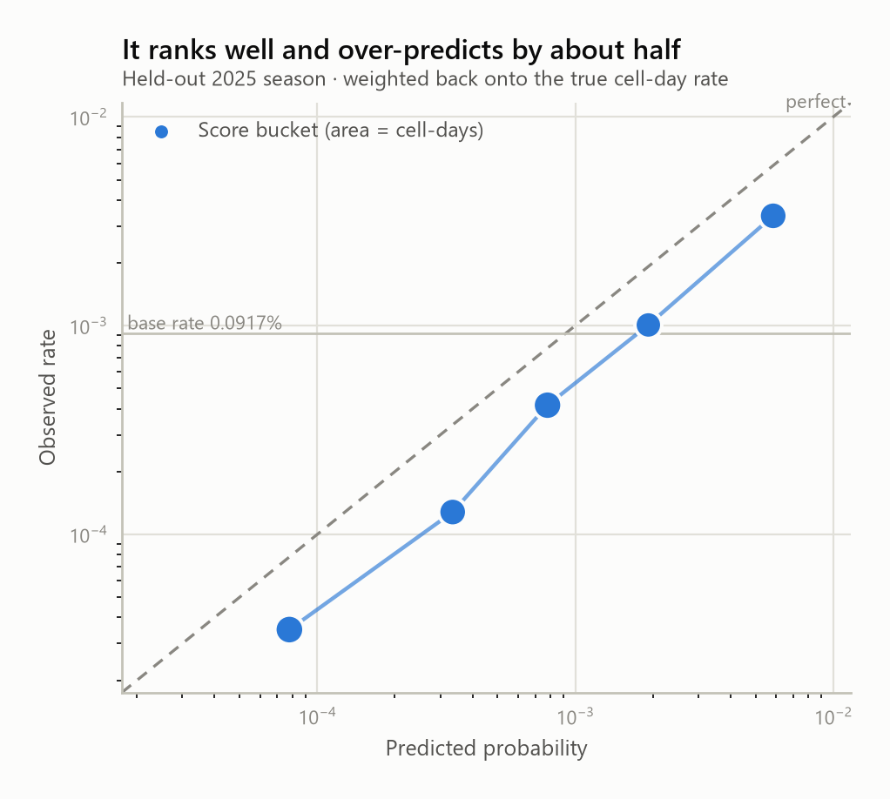
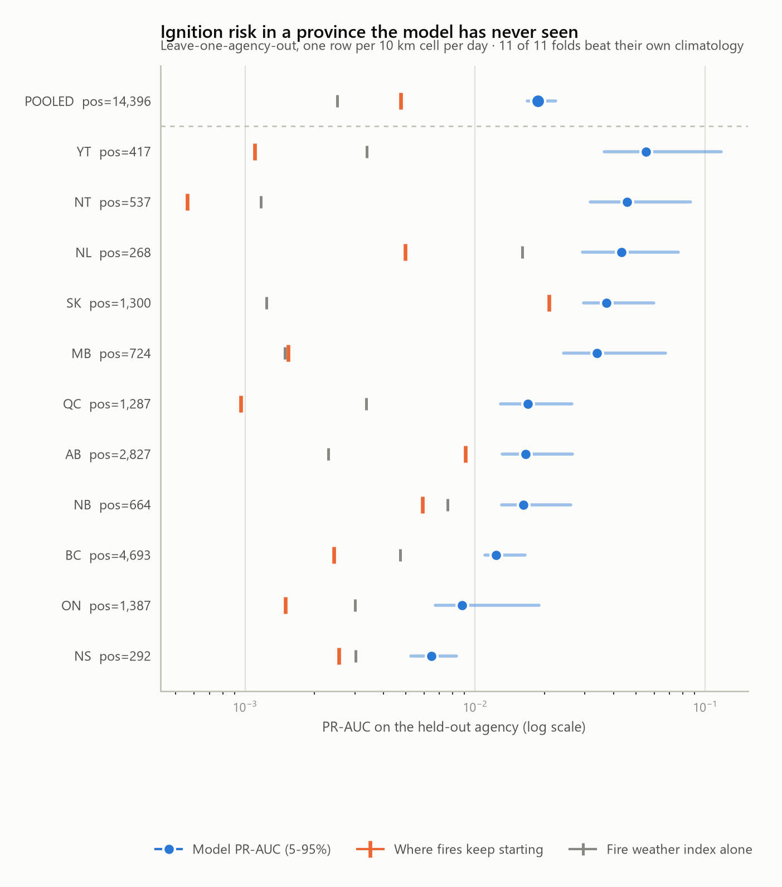

# wildfire-forecast

Two models of Canadian wildland fire, built from open government feeds and no
API keys at all.

- **Escalation** — a fire enters the national reporting system; 24 hours later,
  will it be a large fire (≥ 100 ha) three days after discovery?
- **Ignition** — standing at midnight over a 10 km cell of ground, will a new
  fire be reported there today?

They are the same discipline applied to two different units. Both are blocked
by season *and* by region, both are scored against baselines a fire agency
already has, and both report intervals rather than point estimates. Everything
either of them sees was knowable before its decision instant, which is the only
property that makes the numbers mean anything.

Three legs, each load-bearing:

| Leg | Source | Why it is here |
|---|---|---|
| **API / OGC services** | CWFIF national GeoServer (WFS), CWFIS download services (hotspots, station FWI), Open-Meteo ERA5, NASA FIRMS | dense signal: fire state, satellite detections, fire weather |
| **Browser-rendered source** | CIFFC national situation report | the only source of National Preparedness Level — a human judgement with no machine feed |
| **ML** | two LightGBM classifiers, season- and region-blocked backtests, paired bootstrap ablations | the actual question |
| **Serving** | FastAPI over the artefacts the CLI writes | `predict` writing parquet is not an interface |

---

## The dashboard

One self-contained HTML file — a map of every fire reported in the last three
weeks shaded by modelled escalation risk, today's ignition-risk grid washed
underneath it, the ranked watchlist beside it, and the validation charts for
both models below:

```bash
python -m wildfire dashboard
```

Writes [`docs/dashboard.html`](docs/dashboard.html) (~810 KB) with everything
inlined: provincial boundaries, the scored fires, the ignition grid, and six
charts as base64. It makes **zero external requests**, so it works offline and
cannot lose its basemap to a CDN that moved. It is rebuilt from the same
artefacts the CLI writes, so the page cannot drift from the models it
describes.

The map is Lambert conformal conic — the projection Canada is conventionally
drawn in. Equirectangular would stretch Nunavut badly enough to misplace
northern fires by eye. Note that this is *not* the projection the ignition
grid is defined on, and deliberately so: a map wants shape preserved, a
modelling grid wants area. See [the second model](#1-the-unit-has-to-be-invented).

> The page carries a prominent notice that this is a research model and not
> operational guidance. That is not boilerplate: it shows real fires that are
> burning right now, and someone landing on it cold could otherwise mistake it
> for something official.

---

## The idea the project is built on

The CWFIF reported-fires layer is **bitemporal**. Every fire carries many rows,
each with a `record_start` / `record_end` pair describing the window during
which that row was the system's current belief:

```
2026_PC_2026RM4   0.2 ha  UC   record_start 2026-05-14T15:45 → 21:45
2026_PC_2026RM4   0.05 ha EX   record_start 2026-05-14T21:45 → (open)
```

That means "what was known about this fire at time T" is a **filter**, not a
reconstruction:

```sql
WHERE record_start <= T
```

Point-in-time correctness — normally the hardest thing to get right in a
forecasting pipeline, and the usual source of silently inflated metrics — is
therefore guaranteed at the source rather than by discipline in our code. Every
feature goes through `features/asof.py`, and `tests/test_asof.py` asserts that a
revision recorded after the decision time can never leak into a feature.

Observed depth (2023–2026): **121,575 revision rows across 23,165 fires**, 4–6
revisions per fire, after 25 rows with an impossible timestamp are quarantined
(see [Honest notes](#honest-notes)). Deep enough to model on; `wildfire
diagnose` re-checks this and flags any year that was backfilled as a flat
snapshot.

## No credentials required

The entire Canadian pipeline runs with **zero API keys**. NRCan publishes open
directory listings at `cwfis.cfs.nrcan.gc.ca/downloads/`, and Open-Meteo needs no
key. NASA FIRMS (which does need a free MAP_KEY) is wired up but **optional** —
it buys near-real-time latency (~3 h vs next-morning) and non-Canadian coverage,
not core capability.

A pleasant surprise: the CWFIS hotspot feed is materially richer than raw FIRMS.
Each detection already carries Canadian FBP System outputs computed at that
pixel — `hfi` (head fire intensity, kW/m), `ros` (rate of spread), fuel type,
fuel consumption, and `fwi`. That is a lot of fire science we do not have to
reimplement.

## Architecture

```
sources/          landing zone            features/            models/         api.py
┌──────────────┐  data/raw/**            ┌──────────────┐    ┌───────────────┐  ┌──────┐
│ cwfis_fires  │─ verbatim responses ───►│ asof.py      │───►│ escalation.py │─►│      │
│  (WFS, page) │  + ETag/Last-Modified   │  ONLY way to │    │  per fire     │  │ Fast │
│ cwfis_hotspot│  + fetched_at           │  read state  │    └───────────────┘  │ API  │
│ cwfis_fwi    │                         ├──────────────┤                       │ over │
│  (stations)  │  data/curated/**        │ build.py     │    ┌───────────────┐  │ the  │
│ openmeteo    │─ typed parquet ────────►│  DuckDB      │    │ ignition.py   │  │ art- │
│ firms  (opt) │                         │  haversine   │───►│  per cell-day │─►│efacts│
│ ciffc (API)  │                         ├──────────────┤    │  neg sampling │  │      │
└──────────────┘                         │ grid.py      │    └───────────────┘  └──────┘
                                         │ ignition.py  │
                                         │  10 km LAEA  │
                                         └──────────────┘
```

**Storage is parquet + DuckDB, not Postgres/PostGIS.** Raw responses land
verbatim so a re-parse never costs another request; curated parquet is the
store; DuckDB is the compute engine for the spatial-temporal join (bounding-box
prefilter, then exact haversine). Postgres earns its place at the *serving*
layer, once there is an API to serve — it is not needed to answer the modelling
question, and requiring PostGIS to run a backtest would be friction for nothing.

## Quickstart

```bash
python -m venv .venv && .venv/Scripts/pip install -e .
cp .env.example .env          # optional; only needed for the FIRMS leg
```

```bash
python -m wildfire ingest-fires -y 2023 -y 2024 -y 2025 -y 2026
```

```bash
python -m wildfire ingest-hotspots -y 2023 -y 2024 -y 2025
```

```bash
python -m wildfire diagnose
```

```bash
python -m wildfire build
```

```bash
python -m wildfire backtest --test-years 2025
```

Station weather and the Fire Weather Index — the ignition model's only
exogenous input. The backfill is one large decadal file, streamed once:

```bash
python -m wildfire ingest-fwi -y 2023 -y 2024 -y 2025
```

```bash
python -m wildfire build-ignition && python -m wildfire backtest-ignition --test-years 2025
```

The CIFFC preparedness series backfills from a dated public API, no browser
required (see [below](#the-scraping-leg-that-turned-out-not-to-be-one)):

```bash
python -m wildfire ingest-ciffc -y 2023 -y 2024 -y 2025 -y 2026
```

The rendered-page fallback is still there, and still needs a browser, because
`ciffc.net/situation/` really is a 4 KB shell with an empty `#root`:

```bash
.venv/Scripts/pip install -e ".[scrape]" && .venv/Scripts/playwright install chromium
```

```bash
python -m wildfire scrape-ciffc
```

## The modelling contract

Defined once, in `config.EscalationSpec`:

- **T0** — first appearance in the national feed.
- **Decision time** T0 + 24 h — everything the model sees.
- **Horizon** T0 + 72 h — where the label is read.
- **Label** — `fire_size ≥ 100 ha` at the horizon.
- **Exclusions** — fires already ≥ 100 ha at decision time (the question is
  whether a fire *becomes* large, not whether a large fire stays large), and
  fires too recent to have a 72 h outcome yet (otherwise the newest fires all
  look like non-escalations and the model learns misplaced optimism).

Evaluation reports **three** numbers, not one: the model, a size-at-decision
baseline, and prevalence. A booster that cannot beat "how big is it already"
has learned nothing worth deploying.

## Season-blocked backtest (real numbers)

Train 2023–2024, test 2025. 12,089 fires train / 5,664 test, 2.07% escalation
rate in the test season. Intervals are a 1,000-draw percentile bootstrap over
the test fires, 5th–95th.

| metric | model | size-at-decision baseline | prevalence |
|---|---|---|---|
| PR-AUC | **0.266** [0.216, 0.323] | 0.176 [0.141, 0.228] | 0.021 |
| Brier | **0.0169** | — | 0.0203 |
| ROC-AUC | 0.950 | — | 0.5 |

<picture>
  <source media="(prefers-color-scheme: dark)" srcset="docs/img/pr-curve-dark.png">
  
</picture>

So: **1.51× the precision-recall of "how big is it already"**, and 13× the base
rate. ROC-AUC of 0.950 looks spectacular and mostly is not — with a 2%
positive rate it is dominated by easy negatives, which is exactly why PR-AUC
leads the table.

The interval matters here. 117 positives is not many, and the two marginal
intervals above overlap — which invites the wrong conclusion. The comparison
that settles it is the *paired* one, model and baseline scored on the same
resample: the difference is **+0.089 [0.034, 0.139]**, and the model wins in
**99.7%** of draws. Overlapping marginal intervals on two correlated
statistics are not evidence of a tie.

> **This number was not reproducible, twice, for two different reasons.**
> Both were found the same way: something that could not possibly have changed
> a number appeared to change one.
>
> *In the model.* LightGBM's row subsampling and the calibration split's
> tie-break both read row positions, so the same data laid out differently
> scored anywhere from 0.258 to 0.296 — a spread wider than any feature effect
> this project has measured. `_deterministic` now imposes a total order on
> `(t0, national_fire_id)` before anything reads a row position.
>
> *In the features, one layer down.* Fixing the model did not make the
> pipeline reproducible. DuckDB aggregates in parallel and reduces float64
> partial sums in whatever order threads finish; float addition is not
> associative, so `AVG` drifted in its last bits between runs of the same
> query on the same data, and `MODE` broke ties by scan order. About 35 of
> 21,500 fires had a feature cross a split threshold — worth ~0.008 PR-AUC.
> Sums now accumulate in `DECIMAL(18,6)`, which *is* associative, and the
> dominant fuel type comes from an explicit `ROW_NUMBER()` ordering.
>
> `tests/test_determinism.py` re-runs the aggregation on shuffled input and
> demands identical output; `tests/test_escalation.py` fails if row order ever
> changes a score. **0.266 is the figure that survives building the table
> twice and diffing it.** Every number on this page is post-fix.

Calibration mattered. The first version used `class_weight="balanced"` and had
a Brier score *worse than predicting the base rate* (0.0246 vs 0.0203) — its
top bucket predicted 16.9% where 10.1% actually escalated. Refitting unweighted
and isotonic-calibrating on a temporally held-back slice of the training window
fixed it: Brier 0.0169 against the base rate's 0.0203, and the top bucket
predicts 14.5% against 11.2% observed.

<picture>
  <source media="(prefers-color-scheme: dark)" srcset="docs/img/calibration-dark.png">
  
</picture>

Top features are dominated by `hs_dist_min_km`, `hs_detection_lead_hours` and
`hs_hfi_max` — how close the nearest satellite detection is, how long the
satellite saw it before the agency reported it, and how intense it was burning.
That detection-lead signal is the satisfying one: fires that orbit sees well
before the ground reports them behave differently.

<picture>
  <source media="(prefers-color-scheme: dark)" srcset="docs/img/importance-dark.png">
  
</picture>

Reproduce every figure above with:

```bash
python -m wildfire report
```

## Did it learn fire behaviour, or memorise Alberta?

`lat`, `lon` and `region_code` carry large gain, and a season-blocked split
cannot tell a geographic prior apart from a memorised one. So: hold out a
*region*. Each fold drops one reporting agency from training entirely and
tests on that agency's fires, with the size-at-decision baseline recomputed
inside the fold.

```bash
python -m wildfire backtest --holdout-agency ALL
```

| held out | n_test | pos | PR-AUC | 5–95% | size baseline | lift |
|---|---:|---:|---:|---|---:|---:|
| ON | 2,333 | 44 | 0.405 | [0.301, 0.534] | 0.194 | 2.09× |
| SK | 1,794 | 94 | 0.350 | [0.287, 0.434] | 0.247 | 1.42× |
| QC | 2,212 | 93 | 0.334 | [0.270, 0.411] | 0.197 | 1.69× |
| YT | 523 | 33 | 0.317 | [0.213, 0.459] | 0.133 | 2.39× |
| NT | 683 | 46 | 0.315 | [0.221, 0.428] | 0.118 | 2.68× |
| PC | 339 | 14 | 0.226 | [0.136, 0.408] | 0.294 | **0.77×** |
| BC | 6,191 | 118 | 0.206 | [0.163, 0.259] | 0.160 | 1.29× |
| AB | 4,103 | 38 | 0.204 | [0.127, 0.305] | 0.169 | 1.21× |
| MB | 1,105 | 51 | 0.195 | [0.145, 0.268] | 0.118 | 1.66× |
| **pooled** | **19,283** | **531** | **0.266** | **[0.239, 0.299]** | 0.157 | **1.70×** |

<picture>
  <source media="(prefers-color-scheme: dark)" srcset="docs/img/regions-dark.png">
  
</picture>

**It generalises.** Every fire above was scored by a model that had never seen
its region, and out-of-region PR-AUC (0.266) matches the season-blocked
headline (0.266) almost exactly. **8 of 9 folds** beat their own baseline;
pooled, the model wins 100% of bootstrap draws. Calibration survives the move
too — the top out-of-region bucket predicts 10.4% against 12.1% observed.

The one fold that loses is **PC — Parks Canada**, at 0.77×. It is worth being
clear that this is a genuine miss rather than a rounding artefact: the model
scores 0.226 where size-at-decision alone gets 0.294. But PC is also not a
region. It is federal parkland scattered across the entire country, so
"hold out this region" is the least meaningful framing available, and with 14
positives its interval [0.136, 0.408] spans the baseline comfortably. Treat it
as a known non-result, not a bug to chase.

Blocking *both* axes at once — train 2023–24 minus one agency, test that
agency in 2025 — is the strictest split this data supports, and thin enough
that only six agencies clear ten positives:

```bash
python -m wildfire backtest --holdout-agency ALL --test-years 2025
```

Pooled PR-AUC **0.243 [0.199, 0.298]** against a 0.185 baseline, 1.32× lift,
beating the baseline in 96.7% of draws; 5 of 6 folds win, median lift 1.29×.

### The follow-up that did not pan out

The obvious next move, if the model were leaning on geography, is to drop raw
`lat`/`lon` for transferable ecozone or fuel-regime features. That hypothesis
is testable directly, and it is wrong:

```bash
python -m wildfire compare-geography
```

That runs the leave-one-agency-out backtest twice, with geography and without,
and bootstraps the difference **paired on the same pooled out-of-region
fires** — the only comparison that answers the question, because the two runs
score the identical fires in the identical fold order.

| pooled out-of-region | PR-AUC |
|---|---:|
| with `lat`, `lon`, `agency_code`, `region_code` | **0.266** |
| without them | 0.249 |
| paired difference | **+0.019 [+0.003, +0.036]**, geography helps in 97.6% of draws |

A real effect, and a modest one. So coordinates are not a memorisation crutch:
latitude carries transferable fire-regime signal (a 60°N boreal fire behaves
differently from a 49°N one regardless of who reports it), and a model denied
it does slightly worse in regions it has never seen, not better. Ecozone
features are still worth adding — just *alongside* coordinates, not instead of
them.

The direction is the same one an earlier, pre-determinism-fix run reported
(+0.025 [+0.004, +0.046]); the figures above are the recomputed ones.

**Caveat, stated plainly.** The nine-fold table blocks region but shares
seasons: a Saskatchewan fire in train and a Manitoba fire in test can be
burning under the same synoptic ridge, which flatters it. That confound is why
the doubly-blocked run is reported alongside — it is the honest number, and it
is thin. Both point the same way, which is the reason to believe either.

## The second model: ignition risk

The escalation model needs a fire to already exist. This one asks the question
one step earlier: **standing at midnight over a 10 km cell of ground, will a new
fire be reported there today?**

```bash
python -m wildfire ingest-fwi -y 2023 -y 2024 -y 2025
python -m wildfire build-ignition
python -m wildfire backtest-ignition --test-years 2025
```

It is not the same model on a different key. Four things have to be invented
before it can be posed at all, and each of them is a decision that can quietly
manufacture a good number.

### 1. The unit has to be invented

A fire arrives with its own coordinates; a non-event does not. So: a **10 km
equal-area grid**, and a UTC day.

Equal-area, not the projection the map uses. `docs/dashboard.html` draws Canada
in Lambert conformal conic, which is right for a map — it preserves shape and is
how Canada is conventionally drawn. It is wrong here. Conformal projections
trade area for shape, so a conformal 10 km cell covers noticeably more ground
at 70°N than at 49°N, and the label — "did at least one fire start in this
cell" — would then mean something different at every latitude. The model would
learn that northern cells ignite more often when all that happened is that they
are bigger. `features/grid.py` uses Lambert azimuthal equal-area about 60°N
96°W; `tests/test_grid.py` measures the ground area of a cell at eight places
from Vancouver to Resolute by spherical excess and demands they agree to within
half a percent.

### 2. The domain has to be bounded, and it is not "Canada"

Canada is about a million 10 km cells and almost all of them are tundra, ice or
open water where no fire has ever been reported. Posing the question there
would hand the model a million free negatives a day.

So the study area is the cells that showed **any** fire activity — a report or
a satellite detection — during the **training** seasons only. Drawing it from
all seasons would be a look-ahead: the test season's own fires would be telling
us where to look. It costs 10.8% of the test season's ignitions, which fall
outside the domain and are unreachable by construction. That number is printed
by `build-ignition` rather than buried.

> **This is where the first real bug was.** The CWFIS hotspot feed covers North
> America, not Canada. An activity-derived study area reaches down to 25°N, and
> **two fifths of the cell-days were in the United States** — guaranteed
> negatives, diluting every rate in the table. They were also all labelled `ON`,
> because the nearest Canadian weather station to Florida is in Ontario. The
> country filter is a point-in-polygon test against the same 23 KB simplified
> Natural Earth outlines the dashboard already ships. It places 96.7% of real
> Canadian fire cells inside a province, and where both it and the fire feed
> name an agency they agree 99.2% of the time — so the feed wins where it
> speaks, and the polygon fills in the cells nobody has ever reported a fire in.

### 3. Negatives have to be sampled, and then undone — twice

About **one cell-day in a thousand** carries an ignition. The panel keeps every
positive and a 3% sample of the rest: 335,811 rows, of which 14,396 are
positive. That makes the problem fittable and every raw number it produces
wrong by a known factor, in two separate places:

- **Probabilities** are inflated, because the sample's prevalence is not the
  population's. Keeping a fraction *r* of the negatives multiplies the odds of
  the positive class by 1/*r*; dividing it back out is exact. It is applied
  *after* isotonic calibration, never before — the correction assumes a
  calibrated probability on the sampled distribution as its input.
- **PR-AUC** is inflated for the same reason, because precision is a function
  of prevalence. Every metric here therefore takes sample weights — 1 for a
  positive, 1/*r* for a sampled negative — which reconstructs the curve the
  full population panel would have given.

That second one is not a nicety. **Unweighted, this model's PR-AUC reads about
0.30. The honest figure is 0.019.** A test asserts that a random scorer's
weighted PR-AUC lands on the population base rate rather than the sample's.

### 4. The fire-weather covariate cannot come from the hotspot feed

The hotspot rows carry FWI, but only at pixels that were already burning. Using
them to answer "where will a fire *start*" would be circular: the covariate
exists precisely where the outcome already happened, so "no FWI" and "no fire"
would be very nearly the same column.

So fire weather comes from the **station network** instead — noon-local
observations of temperature, humidity, wind, rain and the six FWI System codes
from ~2,250 stations, taken whether or not anything is alight, inverse-distance
interpolated to each cell centre from its twelve nearest stations within
300 km. The observation used is the *previous* day's, because the FWI System's
reading is taken at noon local time and at the 00:00 decision instant today's
has not been made yet.

Backfill is one 670 MB decadal file (`cwfis_fwi2020sv3.0_ll.csv`), which is why
`http.stream_to_file` exists. It ends on 2025-08-31, so the 2025 test season is
April–August rather than the full April–October; the panel builder clips to the
station record and says so rather than posing the question on days with no
weather. Scoring *today* needs the other endpoint — `ingest-fwi --daily` walks
`fwi_obs/current/` a day at a time and merges the season in progress in. Those
files are not the archive in miniature: upper-case headers, the header repeated
as the first data row, a bare `YYYYMMDD` date, space-padded fields and no
coordinates.

### The result

Train 2023–2024, test 2025. 247,977 sampled cell-days train / 87,834 test,
2,608 ignitions in the test season, population base rate **0.092%** — one
cell-day in 1,090.

The baselines are the two things a duty officer already has at 6am: the **fire
weather map**, and the knowledge of **where fires keep starting**.

| | PR-AUC | 5–95% |
|---|---:|---|
| **model** | **0.0194** | [0.0151, 0.0315] |
| where fires keep starting (`ig_n_365d`) | 0.0063 | [0.0054, 0.0098] |
| fire weather index alone (`wx_fwi`) | 0.0017 | — |
| base rate | 0.0009 | — |

**3.1× the rolling per-cell climatology** and 11.5× the fire weather index,
paired difference **+0.013 [+0.008, +0.025]**, beating climatology in
**1,000 of 1,000** bootstrap draws. ROC-AUC 0.842.

Calibration is the honest weakness. Brier 0.000915 against the base rate's
0.000916 — a hair better, which is another way of saying "not much". The
reliability table is monotone and consistently high: the top bucket predicts
0.59% where 0.34% happened, a factor of about 1.7 across the range. The ranking
is informative; the absolute rate is inherited from seasons that burned harder
than 2025 did.

<picture>
  <source media="(prefers-color-scheme: dark)" srcset="docs/img/ignition-calibration-dark.png">
  
</picture>

### What it is actually using

Same paired ablation as the escalation model — every variant refit on the same
split, differences bootstrapped on the same resampled cell-days:

```bash
python -m wildfire ablate-ignition
```

| feature set | PR-AUC | Δ vs full | paired 5–95% | P(full is better) |
|---|---:|---:|---|---:|
| **full** | **0.0194** | — | — | — |
| no CIFFC block | 0.0207 | +0.0009 | [−0.0040, +0.0048] | 0.333 |
| no network columns | 0.0183 | −0.0016 | [−0.0064, +0.0018] | 0.762 |
| no fire weather | 0.0190 | −0.0011 | [−0.0061, +0.0029] | 0.619 |
| no geography | 0.0148 | −0.0059 | [−0.0126, −0.0016] | 0.993 |
| no weather **and** no geography | 0.0132 | −0.0071 | [−0.0128, −0.0031] | 0.997 |
| no satellite history | 0.0148 | −0.0054 | [−0.0110, −0.0012] | 0.982 |
| no ignition history | 0.0102 | −0.0107 | [−0.0191, −0.0048] | 0.996 |

**Where fires have started, and what is burning nearby, are the model.**
Ignition history is worth 0.0107 and satellite history 0.0054, both clearing
zero comfortably — and the model still beats the raw `ig_n_365d` count by 3.1×,
so it is using that history for more than reading it off.

Two blocks were tested and did not help: the interpolated station fire weather
(−0.0011, interval straddling zero) and the CIFFC preparedness block (+0.0009
*in favour of dropping it*). The last two rows exist to check whether weather
was merely redundant with `lat`/`lon`/`doy` rather than useless — it is not:
the blocks are additive, and weather is worth about a thousandth of a PR-AUC
either way. The CIFFC result is the more interesting one, because the
escalation write-up had predicted the opposite; see
[below](#and-it-does-nothing-for-escalation).

The station feed stays ingested for a stated reason rather than sunk cost: it
is the only *non-circular* fire-weather source available, and the alternative
is no exogenous weather at all.

### Does it work in a province it has never seen?

Same test as the escalation model, and sharper here. Cells are fixed points
that recur every day of the season, so a model with `lat`/`lon` can memorise
individual cells outright — the same coordinates appear hundreds of times in
training. Holding out an entire agency is the only split that makes that
impossible.

```bash
python -m wildfire backtest-ignition --holdout-agency ALL
```

<picture>
  <source media="(prefers-color-scheme: dark)" srcset="docs/img/ignition-regions-dark.png">
  
</picture>

The log axis is forced by the data: PR-AUC spans two orders of magnitude across
folds, because the chance of a fire being reported in a given 10 km cell on a
given day is a hundred times higher in the Yukon's short intense season than on
the Nova Scotia coast. A linear axis collapses every fold but one onto the left
edge.

| held out | pos | PR-AUC | 5–95% | fire weather | climatology |
|---|---:|---:|---|---:|---:|
| YT | 417 | 0.0554 | [0.0363, 0.1173] | 0.0034 | 0.0011 |
| NT | 537 | 0.0457 | [0.0317, 0.0865] | 0.0012 | 0.0006 |
| NL | 268 | 0.0433 | [0.0292, 0.0763] | 0.0160 | 0.0050 |
| SK | 1,300 | 0.0373 | [0.0295, 0.0597] | 0.0012 | 0.0209 |
| MB | 724 | 0.0339 | [0.0243, 0.0670] | 0.0015 | 0.0015 |
| QC | 1,287 | 0.0169 | [0.0129, 0.0263] | 0.0034 | 0.0010 |
| AB | 2,827 | 0.0166 | [0.0131, 0.0265] | 0.0023 | 0.0091 |
| NB | 664 | 0.0162 | [0.0131, 0.0261] | 0.0076 | 0.0059 |
| BC | 4,693 | 0.0124 | [0.0110, 0.0165] | 0.0047 | 0.0024 |
| ON | 1,387 | 0.0088 | [0.0067, 0.0190] | 0.0030 | 0.0015 |
| NS | 292 | 0.0065 | [0.0053, 0.0083] | 0.0030 | 0.0026 |
| **pooled** | **14,396** | **0.0187** | **[0.0169, 0.0224]** | 0.0025 | 0.0047 |

**11 of 11 folds beat both baselines**, pooled lift 3.9× over the stronger of
the two, winning 1,000 of 1,000 draws. Blocking region *and* season at once —
train 2023–24 minus one agency, test that agency in 2025 — is thinner and
agrees: pooled **0.0123 [0.0098, 0.0224]** against a 0.0066 climatology, 1.9×,
7 of 8 folds, beating the baseline in 99.2% of draws.

One thing flips out of region and is worth stating: the season-blocked model
over-predicts by ~1.7×, but pooled *out of region* it **under**-predicts, top
bucket 0.27% predicted against 0.48% observed. Both are the same fact from two
sides — the rate is calibrated to whatever the training set burned like, and it
does not transfer. Rank the cells; do not read the number as a frequency.

## Scoring fires that are burning now

The backtest answers "would this have worked". This answers "what should
someone look at today":

```bash
python -m wildfire fit-final && python -m wildfire predict
```

```
                          Escalation risk - top 10 of 1,032 fires
┌──────────────────┬─────┬───────────────┬───────────────────┬──────────┬───────┬──────────┐
│ fire             │ age │ ha @ decision │ status @ decision │ hotspots │  risk │ size now │
├──────────────────┼─────┼───────────────┼───────────────────┼──────────┼───────┼──────────┤
│ ON  SLK_FIRE_092 │ 15d │          60.0 │ out of control    │      300 │ 0.375 │    2,658 │
│ BC  2026-N11027  │ 11d │          10.0 │ out of control    │      117 │ 0.300 │        2 │
│ ON  NIP_FIRE_039 │ 16d │          50.0 │ out of control    │       25 │ 0.300 │       24 │
│ BC  2026-G40991  │ 12d │           0.0 │ out of control    │        0 │ 0.242 │        0 │
│ BC  2026-C40983  │ 12d │          30.0 │ out of control    │       14 │ 0.242 │   73,217 │
└──────────────────┴─────┴───────────────┴───────────────────┴──────────┴───────┴──────────┘
```

`risk` is the score as it stood 24 h after each fire was first reported;
`size now` is what that fire has since become, and is shown only as context —
it is read at scoring time, long after the decision instant, and is not a
feature.

Three design points, because this is where a model that backtests well usually
starts quietly failing:

- **One feature path.** `predict` calls `assemble_features`, the same function
  that builds the training table; `build()` is that function plus a label. A
  separate serving path is the standard route to training/serving skew.
- **Category levels come from the fitted model**, not from today's data. Rebuilt
  levels renumber themselves whenever an agency happens to have no active
  fires, and the model reads one agency as another.
- **`predict` deliberately uses a different model than the one measured above.**
  The backtest model is handicapped on purpose — trained on 2023–24 so 2025 can
  be held out — and nothing should be *scored* with it. `fit-final` refits on
  every labelled season. The consequence, stated plainly: the deployed model's
  accuracy is **inferred** from the backtest, never directly observed.

One honest wart: isotonic calibration is a step function, so the shipped score
takes only ~26 distinct values and long ties appear (everything at 0.242
above). That is fine for triage — it is a shortlist, not a ranking — but it
means small differences between adjacent rows carry no information.

The ignition model is served the same way, and scoring it is cheap in a way
building its panel is not: the training panel had to sample negatives because
it spans hundreds of days, but a single day is one pass over the study area
with nothing to sample, so every cell is scored.

```bash
python -m wildfire ingest-fwi -y 2026 --daily
python -m wildfire fit-final-ignition && python -m wildfire predict-ignition
```

```
                    Ignition risk 2026-07-31 - top 6 of 26,722 cells
┌──────────┬────────────────┬────────┬──────┬───────────┬──────────┬────────┐
│ cell     │ lat, lon       │ agency │  FWI │ km to stn │ fires/yr │   risk │
├──────────┼────────────────┼────────┼──────┼───────────┼──────────┼────────┤
│ 122,-92  │ 50.34, -78.60  │ QC     │ 10.9 │        29 │        0 │ 0.1131 │
│ 98,-136  │ 46.94, -83.03  │ ON     │ 11.9 │        36 │        0 │ 0.1131 │
│ 107,-138 │ 46.60, -81.92  │ ON     │ 16.9 │        22 │        0 │ 0.0566 │
│ -44,-52  │ 55.17, -102.86 │ SK     │ 14.0 │        61 │       20 │ 0.0368 │
│ -160,-90 │ 49.54, -118.44 │ BC     │ 33.4 │        14 │        5 │ 0.0368 │
│ 54,-49   │ 55.32, -87.37  │ ON     │ 18.7 │       106 │        0 │ 0.0368 │
└──────────┴────────────────┴────────┴──────┴───────────┴──────────┴────────┘
```

Two differences from training, both deliberate. The study area is drawn from
**every** season on disk rather than the training ones — restricting it was a
guard against evaluating on a domain defined by the test season's own fires,
and at serving time there is no test season, so narrowing it would only blind
the model to country that has burned since. And the prior correction uses the
`neg_rate` stored *in the fitted model*, not the current default: a model
fitted under one sampling rate and corrected with another is wrong by exactly
the ratio, and nothing would raise.

## Serving it over HTTP

`predict` writing parquet is fine for a person with a terminal and useless for
anything else.

```bash
pip install -e ".[serve]" && python -m wildfire serve
```

`http://127.0.0.1:8000/docs` for the generated OpenAPI page.

| endpoint | |
|---|---|
| `GET /health` | liveness only; asserts nothing about the artefacts |
| `GET /v1/meta` | when every artefact was last written, and which are missing |
| `GET /v1/models` | both model cards: target, spec, training seasons, held-out accuracy |
| `GET /v1/fires` | ranked escalation risk; `?agency=`, `?min_risk=`, `?limit=` |
| `GET /v1/fires/{national_fire_id}` | one fire |
| `GET /v1/ignition` | ranked cells for a day; `?day=`, `?bbox=`, `?min_risk=` |

Three decisions, all of them about what a serving layer for a *research* model
should refuse to do.

**It serves artefacts; it does not run the pipeline.** Every endpoint reads a
file the CLI wrote. Nothing here ingests, refits or rebuilds. A rebuild is a
five-minute job against half a dozen government endpoints, and putting that
behind a request handler means the first curious visitor DDoSes NRCan on your
behalf. Freshness is a scheduling problem; `/v1/meta` reports it rather than
hiding it, and the read-through cache is keyed on file mtime so a scheduled
`predict` is picked up without a restart.

**Every score carries its provenance.** A bare probability is the thing that
ends up in a slide deck with no asterisk. Each risk payload names the model,
the seasons it was fitted on, the instant the data was current as of, and the
held-out interval that is the only evidence about its accuracy — which, because
the deployed model is refit on every labelled season, is *inferred* rather than
measured.

**A missing artefact is 503, not 404 and not an empty list.** The route exists
and will work once the pipeline has run. A 404 tells a client to stop asking;
an empty 200 is a lie.

And the disclaimer is in the payload, not only on the HTML page — anyone
consuming JSON never sees the page, and a research model over a live fire feed
is exactly the kind of thing that gets mistaken for an official product.

## The scraping leg that turned out not to be one

CIFFC publishes the National Preparedness Level — the country's judgement
about how stretched suppression resources are. At PL 4–5 crews and aircraft
are rationed, which changes how a new fire is fought. There is no machine feed
for it, so this project was built to scrape it.

The premise was half right. `ciffc.net/situation/` really is a 4 KB shell with
an empty `#root`; plain HTTP gets you nothing. But the page loads no data
either — no XHR at all — which meant the numbers had to be reachable some
other way. They are: the JS bundle calls `api.ciffc.net/v1/sitrep`, and that
endpoint

- takes `?date=YYYY-MM-DD` and serves any past report,
- needs no credentials — the logged-out code path sends no `Authorization`
  header, and neither do we,
- carries far more than the page renders, including per-agency preparedness
  broken into its five components and each agency's own forecast of tomorrow's
  lightning- and human-caused ignitions.

`/v1/sitrep/archive` lists every published report — **1,025 of them, back to
2019** — and already contains the national PL for each, so the national series
costs one request.

This changed the leg from a liability into an asset. A scraped page only ever
shows *today*, so the series would have had to be accumulated forward and
could never have been a feature for a 2023–25 backtest. Because the API is
dated, the whole history comes down in one pass and preparedness becomes
**trainable**. Reports exist only for the fire season (April–October), which
is ~140 days a year rather than 365.

`render()` and `parse()` are kept as a documented fallback, and their
selectors were verified against the live DOM rather than left unproven — the
page does use real `<table>` elements, and the per-agency APL table it exposes
is now parsed too.

### Joining it without leaking

A sitrep is *dated* for a day but *published* late on that day — around 20:00
UTC — and it contains an explicit forecast of tomorrow's fire load. Joining on
`sitrep_date` would hand a fire first reported that morning a judgement made
hours after its decision instant. So ingestion carries `published_at` from
each record's `system_edit_timestamp`, and the feature join is an as-of
backward join on that column, per agency. `tests/test_preparedness.py` asserts
a report published after the decision instant cannot be seen.

### And it does nothing for escalation

Worth saying plainly, because the effort suggests otherwise. 6,565 agency-day
rows joined onto 98.5% of fires, and it does not help:

```bash
python -m wildfire ablate
```

Each variant is refit from scratch on the same split and the differences are
bootstrapped **paired** — on the same resampled test fires. That pairing is
what makes the table readable at all. With 117 positives every marginal
interval below swallows every other row's point estimate, so a table of
marginal intervals would say "no difference" no matter what was true.

| feature set | PR-AUC | Δ vs full | paired 5–95% | P(full is better) |
|---|---:|---:|---|---:|
| **full** | **0.266** | — | — | — |
| no CIFFC at all | 0.278 | +0.011 | [−0.012, +0.033] | 0.196 |
| national + agency PL only | 0.279 | +0.013 | [−0.004, +0.032] | 0.098 |
| no geography | 0.275 | +0.010 | [−0.019, +0.039] | 0.274 |
| no satellite hotspots | 0.153 | **−0.114** | [−0.153, −0.077] | **1.000** |

Two things fall out of that table.

**CIFFC is not merely neutral — if anything it costs a little.** Dropping the
whole block gains +0.011 and the interval still straddles zero, so the honest
reading is "no detectable benefit, possibly a small dilution cost". An earlier
unpaired version of this table reported +0.002 *in favour*; the sign flipped
inside the noise, which is exactly what an effect of zero looks like when it is
measured twice. The likely reason is structural: preparedness is one value per
agency per day, so every fire burning in one agency that day shares it — and
`doy`, `agency_code` and `region_code` already encode most of that
seasonal-and-regional load pattern.

**The satellite block is the model.** Take the hotspot features away and
PR-AUC falls to 0.153, below the 0.176 that size-at-decision alone achieves.
The paired interval is nowhere near zero and the full model wins 1,000 draws
out of 1,000. Everything else in the feature list is a rounding error next to
"what did orbit see near this fire in the last 24 hours".

`ciffc_sitrep_lag_hours` — how stale the report was — is built and kept in the
modelling table but **excluded from the feature list**. It measures the
reporting calendar, not the fire, and it is the only variant that scored below
the no-CIFFC baseline. It briefly ranked as the #2 feature by gain, which is a
good reminder that gain measures how much a model *used* something, not
whether it should have.

The ingestion stays anyway, and it was re-tested on the ignition model, where
the unit of prediction genuinely is an agency and a day. [It does nothing
there either](#what-it-is-actually-using). That is the useful version of this
result: the covariate was given the task it was supposed to suit, and measured,
and it still did not help.

## Honest notes

- **ERA5 is reanalysis.** It is used only for the window that had already
  elapsed at decision time. Using it across the *forecast* window would be
  leakage dressed as a feature; a production system would substitute the actual
  forecast available at T0 + 24 h.
- **ERA5 is off by default** (`build --weather` to enable). It costs one HTTP
  request per fire-cell/date window. The hotspot feed already carries FWI, so
  the escalation model is not blind without it. This is separate from the
  station FWI feed, which is always on and is the ignition model's exogenous
  leg.
- **Non-vegetation detections are dropped** (`water`, `urban`, flares). Keeping
  them teaches the model that gas plants are fires.
- **Implausible `record_start` values are quarantined**, not trusted and not
  silently deleted. 25 revision rows across 2023 fires fail the plausibility
  window — two dated 2011, the rest dated 2025 or 2026 against a stale
  `fire_year` — and they matter out of all proportion to their number, because
  T0 is `min(record_start)` per fire and one bad row moves that fire's entire
  decision instant. They are written to
  `curated/reported_fires_quarantine.parquet` so the rule can be audited and
  argued with. Effect on the headline: PR-AUC 0.2641 → **0.2658**.
- **`percent_contained` is out of the feature contract.** The feed reports it
  for 0.6% of fires and with two distinct values, so LightGBM never split on
  it: the paired ablation measured the difference at exactly 0.0000 with a
  [0, 0] interval — the two models' predictions were bit-identical. It stays in
  the modelling table as a diagnostic. `severity_nearest_dsr` never reached the
  table at all.
- **The ignition model's absolute probabilities run about 1.7× high**, because
  2023–24 burned harder than 2025 did and the calibrator was fitted on them.
  Its ranking is what the numbers above measure; its rate is not.
- **The 2025 ignition season is April–August**, not April–October, because the
  station FWI archive ends on 2025-08-31. The *current* season is refreshed
  from the daily endpoint instead (`ingest-fwi --daily`), so scoring is not
  stuck a year behind evaluation — but the two use different files with
  different schemas, and only the archive can be backfilled.
- **10.8% of 2025 ignitions are outside the study area** and cannot be
  forecast, because the domain is drawn from 2023–24 activity only. Widening it
  would improve the number and would be a look-ahead.

## Status

**Working.** Ingestion for every source — the bitemporal fire feed, 9.1 M
satellite hotspots, the full CIFFC preparedness backfill, and 1.08 M
station-days of weather and FWI. The bitemporal as-of layer, both feature
builders, and both models: escalation per fire and ignition per 10 km cell per
day. Backtests season-blocked, region-blocked and both at once, with bootstrap
intervals throughout and paired ablations for every block of features. Live
scoring for both models, an HTTP layer over the results, the self-contained
dashboard, and the figures on this page. Reproducible bit-for-bit, verified by
building the modelling table twice and diffing it rather than by assertion.
**97 tests**, no network, no data, about ten seconds; CI runs them on every
push.

**Not built.** A production forecast leg — every weather covariate here is an
observation of a window that had already closed at the decision instant, which
is honest but is not what an operational system would use at T0 + 24 h. No
lightning-strike feed (CLDN is not public), which is the single largest missing
input for ignition. No values-at-risk, terrain, or road/settlement layers.

Next: **see [NEXT_STEPS.md](NEXT_STEPS.md)** — prioritised work, the invariants
not to break, and the gotchas already paid for. It is written to be picked up
cold.
